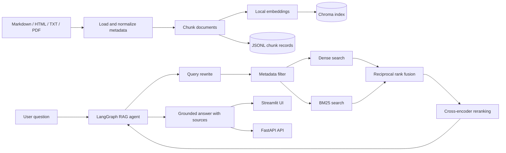

# Mini RAG Assistant

A complete, local-first Retrieval-Augmented Generation (RAG) application for asking grounded questions about technical documentation. The project combines document ingestion, metadata-aware hybrid retrieval, reranking, a LangGraph-powered agent, a Streamlit interface, a FastAPI service, and an evaluation pipeline in one reproducible codebase.

The language model runs locally through Ollama, while embeddings and reranking are performed with local Hugging Face models. No OpenAI or Gemini API key is required.

## Features

- Ingests Markdown, HTML, TXT, and text-based PDF documents.
- Splits documents with `RecursiveCharacterTextSplitter` and preserves source metadata.
- Stores dense embeddings in a persistent Chroma vector database.
- Combines semantic retrieval and BM25 keyword search with reciprocal rank fusion.
- Rewrites user questions into focused search queries before retrieval.
- Supports filters for source, document type, year, date, file, and PDF page.
- Reranks candidates with a cross-encoder and uses lexical scoring as a fallback.
- Uses a LangGraph ReAct agent to call the retrieval tool and generate grounded answers.
- Returns citations, retrieved chunks, latency data, and pipeline diagnostics.
- Provides both a Streamlit UI and a typed FastAPI endpoint.
- Includes a 20-question evaluation dataset and reproducible quality metrics.
- Uses an explicit fallback when the indexed context does not contain the answer.

## Architecture



The request pipeline is:

```text
question
-> LangGraph agent
-> search_rag_database(query, metadata)
-> query rewrite
-> metadata filtering
-> dense + BM25 retrieval
-> reciprocal rank fusion
-> reranking
-> grounded answer with source attribution
```

## Technology Stack

| Layer | Technology |
| --- | --- |
| Agent orchestration | LangGraph, LangChain |
| Local LLM | Ollama (`llama3.1:8b` by default) |
| Embeddings | Sentence Transformers (`all-MiniLM-L6-v2`) |
| Vector database | Chroma |
| Keyword retrieval | BM25 |
| Reranking | Cross-Encoder (`ms-marco-MiniLM-L-6-v2`) |
| Web interface | Streamlit |
| API | FastAPI, Uvicorn |
| Document parsing | PyPDF, Beautiful Soup, LangChain loaders |

## Project Structure

```text
mini-rag-assistant/
├── data/
│   ├── raw/                 # Source documents grouped by format
│   ├── processed/           # Chunk records and source metadata
│   ├── chroma/              # Persistent vector index
│   └── eval/                # Evaluation questions and results
├── notebooks/
│   └── run_eval.ipynb       # Notebook evaluation entry point
├── src/
│   ├── answering/           # LangGraph agent and grounded answer generation
│   ├── app/                 # Streamlit and FastAPI applications
│   ├── evaluation/          # Metrics and evaluation runner
│   ├── ingestion/           # Loaders, chunking, metadata, and indexing
│   ├── retrieval/           # Query rewriting, hybrid retrieval, and reranking
│   └── config.py            # Environment-based settings
├── .env.example
├── requirements.txt
└── report.md                # Implementation report and evaluation details
```

## Prerequisites

- Python 3.11 or newer
- Git
- [Ollama](https://ollama.com/)
- Enough disk space for the local LLM, embedding model, reranker, and Chroma index

## Installation

Clone the repository and enter the project directory:

```bash
git clone https://github.com/Yon1k3/mini-rag-assistant.git
cd mini-rag-assistant
```

Create and activate a virtual environment:

```bash
python -m venv .venv
source .venv/bin/activate
```

On Windows PowerShell:

```powershell
python -m venv .venv
.\.venv\Scripts\Activate.ps1
```

Install the dependencies and create the local configuration:

```bash
python -m pip install --upgrade pip
pip install -r requirements.txt
cp .env.example .env
```

On Windows PowerShell, use `Copy-Item .env.example .env` instead of `cp`.

Download the default Ollama model:

```bash
ollama pull llama3.1:8b
```

Make sure the Ollama service is running before starting the application.

## Prepare and Index Documents

Place source files in the matching directory:

```text
data/raw/markdown/
data/raw/html/
data/raw/pdf/
data/raw/txt/
```

The optional catalog at `data/processed/source_metadata.json` can associate each local file with its original URL, source name, document date, and year. PDF page numbers and section titles are added during ingestion when available.

Build or rebuild the index:

```bash
python src/ingestion/build_index.py
```

This command creates `data/processed/chunks.jsonl` and persists the Chroma collection in `data/chroma/`.

## Run the Streamlit Application

```bash
python -m streamlit run src/app/streamlit_app.py
```

Open [http://localhost:8501](http://localhost:8501). The sidebar exposes all available metadata filters, while the result view shows the answer, sources, retrieved chunks, and latency.

## Run the FastAPI Service

```bash
python -m uvicorn src.app.api:app --reload --port 8000
```

Interactive API documentation is available at [http://localhost:8000/docs](http://localhost:8000/docs).

### Ask a Question

```http
POST /ask
Content-Type: application/json
```

```json
{
  "question": "What is FastAPI used for?",
  "metadata_filter": {
    "document_year": 2022
  },
  "thread_id": "demo-thread"
}
```

Example with no explicit filter:

```json
{
  "question": "Explain how Pydantic validators work.",
  "metadata_filter": {},
  "thread_id": "demo-thread"
}
```

The API returns the generated answer, normalized answer text, source records, retrieved context, end-to-end and retrieval latency, pipeline name, failure reason, and thread ID.

### Supported Metadata Filters

| Field | Example | Description |
| --- | --- | --- |
| `document_source` | `"FastAPI"` | Documentation collection or publisher |
| `document_type` | `"markdown"` | `markdown`, `html`, `pdf`, or `txt` |
| `document_year` | `2022` | Document year |
| `document_date` | `"2022-01-01"` | Exact document date |
| `source_file` | `"data/raw/html/fastapi-home.html"` | Local source path |
| `page_number` | `15` | One-based PDF page number |

Filters can be supplied through the UI or API. When the question explicitly mentions a year, date, source, format, file, or page, the agent can also populate the corresponding tool metadata automatically.

## Evaluation

Run the full evaluation suite from the command line:

```bash
python src/evaluation/run_eval.py
```

Alternatively, open `notebooks/run_eval.ipynb`. Results are written to `data/eval/eval_results.json`.

The included 20-question full-pipeline evaluation produced:

| Metric | Result |
| --- | ---: |
| Questions | 20 |
| Source recall@k | 0.850 |
| Groundedness | 0.673 |
| Answer keyword match | 0.804 |
| Average latency | 16.719 s |

Results depend on the local hardware, Ollama model, indexed corpus, and retrieval settings.

## Configuration

All settings can be overridden in `.env`:

| Variable | Default | Purpose |
| --- | --- | --- |
| `OLLAMA_MODEL` | `llama3.1:8b` | Local chat model |
| `LOCAL_EMBEDDING_MODEL` | `sentence-transformers/all-MiniLM-L6-v2` | Embedding model |
| `VECTOR_DB` | `chroma` | Vector database provider |
| `CHUNK_SIZE` | `1000` | Maximum chunk size |
| `CHUNK_OVERLAP` | `150` | Overlap between adjacent chunks |
| `TOP_K` | `5` | Number of fused retrieval results |
| `RERANK_TOP_N` | `3` | Number of chunks retained after reranking |
| `RERANKER_PROVIDER` | `auto` | Reranker selection with lexical fallback |
| `CROSS_ENCODER_MODEL` | `cross-encoder/ms-marco-MiniLM-L-6-v2` | Reranking model |
| `EVAL_MAX_QUESTIONS` | `0` | Evaluation limit; `0` runs all questions |
| `EVAL_SLEEP_SECONDS` | `0` | Delay between evaluation requests |
| `EVAL_RESUME` | `false` | Resume an interrupted evaluation run |

## Grounding and Failure Behavior

The agent must call the local retrieval tool before answering and is instructed to use only retrieved context. Source metadata is carried into the final response whenever available. If no relevant evidence is found, the assistant returns:

```text
I don't know based on the provided context.
```

## Limitations

- Scanned or image-only PDFs require external OCR before ingestion.
- Only text-based PDFs are parsed directly.
- Ollama is the only configured LLM provider.
- Initial model downloads and index construction can take time.
- Response latency depends on the selected model and local hardware.

## Additional Documentation

See [`report.md`](report.md) for the implementation report, pipeline discussion, evaluation methodology, and detailed examples.
